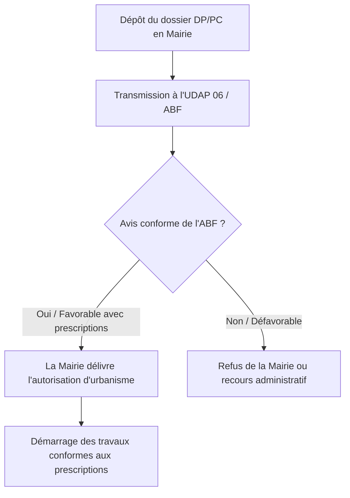

Le département des Alpes-Maritimes possède un patrimoine architectural d'une richesse exceptionnelle. Des façades colorées du Vieux-Nice aux toits ocre de Menton, en passant par les ruelles médiévales de Mougins et les bastides historiques de Grasse, la préservation de ce paysage urbain est rigoureusement encadrée. 

Si votre bien immobilier est situé à proximité d'un monument historique ou dans un périmètre protégé, tout projet de modification de la toiture (réfection, isolation par l'extérieur, pose de fenêtres de toit ou modification des gouttières) doit obligatoirement obtenir l'accord de l'**Architecte des Bâtiments de France (ABF)**.

Ce guide technique détaille les règles d'urbanisme applicables aux toitures patrimoniales du 06, les matériaux imposés et la procédure administrative à suivre pour obtenir l'approbation de l'ABF.

---

## Le cadre réglementaire : SPR, PSMV et Périmètres de Protection

La protection du patrimoine bâti s'organise autour de trois dispositifs majeurs gérés par l'Unité Départementale de l'Architecture et du Patrimoine (UDAP 06) :

1. **Les Sites Patrimoniaux Remarquables (SPR)** : Remplaçant les anciennes AVAP et ZPPAUP, ils protègent des quartiers entiers ou des villages pour leur intérêt historique, artistique ou paysager (ex. le SPR de Nice, de Grasse ou de Menton).
2. **Le Plan de Sauvegarde et de Mise en Valeur (PSMV)** : C'est le document d'urbanisme le plus restrictif. Il se substitue au PLU local et réglemente de manière extrêmement précise chaque élément du bâtiment, y compris la nature exacte des tuiles et des enduits de faîtage (ex. PSMV du Vieux-Nice).
3. **Les abords de Monuments Historiques (périmètre délimité ou rayon de 500 mètres)** : Toute intervention visible depuis un monument classé ou inscrit nécessite un avis conforme de l'ABF.

---

## Les exigences matérielles de l'ABF pour les toitures du 06

L'ABF veille au maintien de l'authenticité des toitures méditerranéennes en proscrivant les matériaux industriels modernes standardisés et les teintes exogènes.

### 1. Le choix des tuiles : respect des formes et teintes régionales
- **La Tuile Canal** : C'est le modèle traditionnel exigé par excellence dans le vieux-pays et pour les maisons rurales anciennes. L'ABF impose l'utilisation de tuiles canal en terre cuite de teintes nuancées (ocre jaune, paille, rouge flammé, ocre vieilli) imitant la patine du temps. L'utilisation de tuiles de teinte rouge vif uniforme est strictement interdite. 
  - *Astuce technique approuvée* : Pour optimiser l'étanchéité tout en respectant l'ABF, on utilise une plaque sous-tuile (PST) en fibres-ciment support de tuile, sur laquelle sont collées des tuiles canal de récupération en courant (tuiles visibles) et des tuiles canal neuves en sous-face (tuiles de couvert).
- **La Tuile de Marseille (Plate mécanique)** : Acceptée sur les immeubles de la Belle Époque, les villas du début du XXe siècle et les bâtiments hors cœurs médiévaux. L'ABF exige des modèles présentant des patines foncées ou vieillies.

### 2. Le traitement des rives, faîtages et solins
L'utilisation de ciment gris moderne ou de plastiques pour sceller les tuiles est formellement proscrite.
- **Faîtage et rives scellés à la chaux** : Les tuiles de faîtage et de rive doivent être posées avec un **mortier de chaux naturelle (NHL)** coloré dans la masse à l'aide de sable local ou de pigments naturels ocre jaune ou ocre rouge. Les débords de rive doivent être réalisés en "génoise" (succession de rangs de tuiles canal maçonnés en surplomb de la façade) ou avec des rives biaises traditionnelles.
- **Les solins de cheminée** : Réalisés obligatoirement en mortier de chaux ou en zinc naturel plissé, peints dans le ton de la façade.

### 3. Zinguerie et évacuation des eaux pluviales
L'ABF refuse systématiquement les matériaux synthétiques comme le PVC ou les métaux laqués brillants pour les descentes de toiture.
- **Gouttières autorisées** : Exclusivement en **cuivre naturel** ou en **zinc naturel**. Le cuivre est particulièrement recommandé pour les façades de prestige et les monuments historiques en raison de sa patine noble vert-de-gris.
- **Façonnage** : Les fixations (crochets) doivent être forgées et les raccordements de gouttières soudés à l'étain (pas de raccords collés au mastic silicone).

---

## Tableau de Compatibilité des Matériaux en Secteur ABF (06)

| Élément de toiture | Matériaux interdits ❌ | Matériaux autorisés / imposés  |
| :--- | :--- | :--- |
| **Couverture** | Tuile béton unie, ardoise synthétique, tuile vernissée foncée, shingle. | Tuile canal en terre cuite nuancée, tuile de Marseille patinée vieillie d'usine. |
| **Gouttières & Descentes**| PVC (gris, blanc, marron), Aluminium laqué blanc brillant, Acier galvanisé de base. | Cuivre naturel, Zinc naturel (posé brut pour patine grise mate). |
| **Fenêtres de toit (Velux)**| Modèle standard saillant en aluminium gris clair sans barreau central. | Fenêtre encastrée dans le plan de toit (pose affleurante), châssis de toit en fonte ou acier noir avec meneau central (barre de séparation verticale). |
| **Mortier & Enduits** | Ciment Portland gris ou blanc pur, mortiers prêts-à-l'emploi gris. | Mortier de chaux naturelle (NHL 3.5 ou 2), sable ocre local. |

---

## Le processus d'obtention de l'accord de l'ABF

Pour réaliser des travaux de toiture en zone protégée, vous devez déposer une demande d'autorisation d'urbanisme en mairie : une **Déclaration Préalable (DP)** pour un simple remplacement de tuiles à l'identique avec isolation, ou un **Permis de Construire (PC)** si vous modifiez la pente ou créez des ouvertures (lucarnes, fenêtres de toit).

### Déroulement de l'instruction administrative

### Délais d'instruction spécifiques
En zone protégée, les délais d'instruction légaux sont rallongés pour permettre l'étude du dossier par l'ABF :
- **Déclaration Préalable** : Le délai passe de 1 mois à **2 mois**.
- **Permis de Construire** : Le délai passe de 2 mois à **3 ou 4 mois** selon les cas.

> [!WARNING]
> Si vous réalisez des travaux de toiture en zone protégée sans déclaration préalable ou sans respecter les prescriptions de l'ABF, vous vous exposez à une amende pénale pouvant aller jusqu'à 300 000 € (Art. L480-4 du Code de l'urbanisme) et à l'obligation de remettre le toit en conformité à vos frais.

---

## Foire Aux Questions (FAQ)

### L'ABF peut-il refuser l'installation de fenêtres de toit (type Velux) ?
**Oui**, l'ABF limite fortement le nombre et la taille des fenêtres de toit pour préserver l'harmonie visuelle globale des toitures méditerranéennes depuis les points de vue publics. S'il les accepte, il impose généralement des modèles encastrés dans la couverture (pose affleurante avec raccords de couleur sombre) et équipés d'un **meneau central** vertical imitant les anciens châssis de toit en fonte de type tabatière.

### Peut-on installer des panneaux solaires photovoltaïques en zone ABF dans le 06 ?
C'est un sujet délicat. L'ABF refuse presque systématiquement les panneaux solaires posés en surimposition sur les toitures traditionnelles en tuiles canal visibles depuis l'espace public historique. Cependant, des solutions peuvent être validées :
- Installation sur un toit plat non visible (toiture terrasse).
- Utilisation de **tuiles solaires photovoltaïques** en terre cuite dont la couleur et la forme se confondent parfaitement avec la couverture environnante.
- Pose au sol ou sur des pergolas à l'arrière du jardin, non visibles depuis la rue.

### Quel est l'impact de l'avis de l'ABF : avis conforme ou avis simple ?
Dans la majorité des périmètres protégés (abords de monuments historiques et SPR), l'avis de l'ABF est **conforme**. Cela signifie que le maire de la commune est juridiquement lié par la décision de l'ABF : si l'ABF refuse le projet ou impose des modifications de matériaux, le maire ne peut pas délivrer l'autorisation d'urbanisme sans respecter ces exigences.
